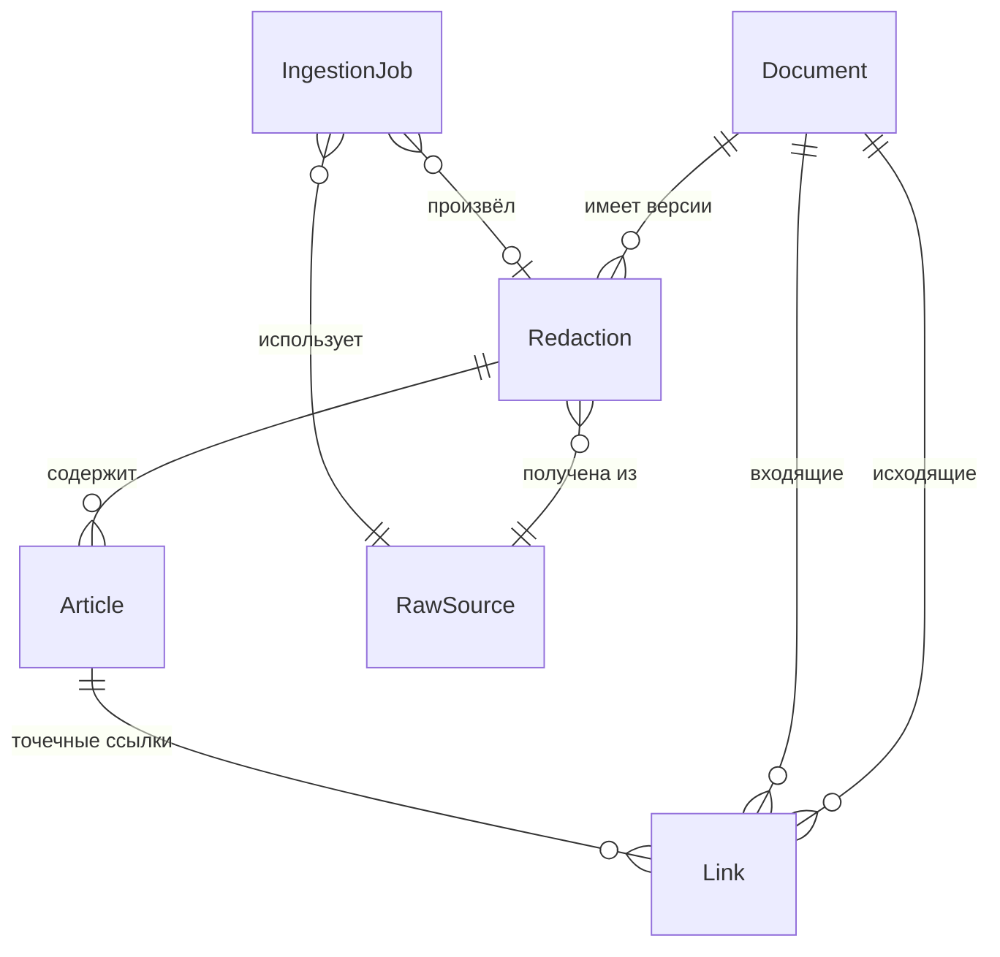

# Lawiot — Спецификация MVP (v1)

**Внутренний справочник нормативно-правовых актов по трудовому праву**

- Дата: 2026-06-05
- Статус: дизайн утверждён, готов к написанию плана реализации
- Стек: Django + PostgreSQL (монолит)

---

## 1. Обзор

Lawiot — внутренний веб-инструмент типа «справочно-правовая система» (аналог Гарант/КонсультантПлюс), но **узкого назначения**: поиск и чтение нормативно-правовых актов (НПА) по **трудовому праву РФ**.

Главный пользовательский сценарий: *«найти нужный акт и прочитать его актуальную редакцию»*. Ядро системы — **полнотекстовый поиск + удобный просмотрщик документа со связями (гиперссылками между актами)**.

Корпус наполняется **автоматическим парсером** из официального источника (`pravo.gov.ru`), с обязательным этапом **ручной проверки куратором** перед публикацией.

### Пользователи и роли
- **Читатель** — ищет и читает опубликованные акты.
- **Куратор** — проверяет результаты парсинга, правит реквизиты/текст/связи, публикует редакции. Работает через Django admin.

---

## 2. Контекст и ключевые решения

### Зафиксированные вводные (итоги брейншторма)
| Параметр | Решение |
|---|---|
| Тип проекта | Внутренний инструмент под нишу |
| Ниша | Отрасль права — **трудовое право** (ядро: ТК РФ + подзаконка) |
| Главный сценарий | Справочник: найти и прочитать актуальную редакцию |
| Источник данных | Автопарсинг официального источника (`pravo.gov.ru`) + ручная доводка |
| Консолидация | Упрощённая (см. §4) |
| Кто строит | В основном Claude под управлением пользователя → приоритет простоты и сопровождаемости |
| Архитектура | Django + PostgreSQL, монолит (Вариант A) |

### Принципы, которыми руководствуемся
1. **Минимум движущихся частей.** Вся система = Django + PostgreSQL. Никаких микросервисов, отдельного поискового движка или Redis в v1.
2. **Данные важнее кода.** Главная ценность и главный риск — в качестве корпуса. Поэтому надёжность приёма данных и контроль качества (куратор) приоритетнее красоты интерфейса.
3. **Юридическая корректность превыше автоматизации.** Опубликованный текст меняется только через подтверждение человеком. Автопарсер никогда не публикует сам.
4. **Изоляция и тестируемость.** Сетевые операции отделены от чистого разбора; каждый модуль имеет одну зону ответственности.

### Правовая основа использования данных
Тексты НПА — «официальные документы» и **не охраняются авторским правом** (ч. 6 ст. 1259 ГК РФ), поэтому использование официальных текстов из `pravo.gov.ru` допустимо. **Нельзя** копировать консолидированные редакции, рубрикаторы, комментарии и иные продукты коммерческих СПС (КонсультантПлюс, Гарант) — это их интеллектуальная собственность.

---

## 3. Границы MVP

### В v1 (делаем)
- Сидовый корпус: **ТК РФ + 5–15 ключевых подзаконных актов** трудового права; список расширяемый куратором.
- Подсистема приёма: автопарсер из официального источника **+ ручной импорт** как запасной путь.
- Модель данных «Документ → Редакция → Статьи» с реквизитами.
- Внутрикорпусные связи: «ссылается / на него ссылаются», «изменяет / изменён».
- Поиск: полнотекстовый (русский) + фильтры по реквизитам.
- Просмотрщик: реквизиты, оглавление, якоря по статьям, панели связей, переходы по ссылкам.
- Курирование через Django admin: очередь на проверку, правка, публикация, простой диф.
- Обнаружение изменений по расписанию: новая/изменённая редакция → черновик на проверку.
- Авторизация: внутренние пользователи, роли «читатель / куратор».
- Контейнеризация (Docker compose) для разработки и развёртывания.

### Не в v1 (осознанно откладываем)
- **Автоконсолидация** (автоматическое слияние поправок в текст базового акта) — самое дорогое, требует NLP по языку поправок.
- Судебная практика, экспертные комментарии, аналитика.
- Несколько отраслей / весь федеральный корпус / региональное законодательство.
- Публичная регистрация, биллинг, подписки, тарифы.
- Уведомления и алерты об изменениях (это сценарий «мониторинг», а не «справочник»).
- Полноценное сравнение редакций (diff для читателя), мобильные приложения, SPA-интерфейс.
- OCR сканов (старые акты-изображения): в v1 такие акты заводятся вручную.
- Тематические рубрикаторы/классификаторы (в v1 — максимум простые теги, опционально).

---

## 4. Определение «актуальной редакции» (упрощённая консолидация)

> **«Актуальная редакция» в v1 = последняя опубликованная куратором полная версия текста акта.**

- Поправки фиксируются как **связи** (`Link`, тип «изменяет/изменён»), но **НЕ вливаются автоматически** в текст базового акта.
- Когда официальный источник публикует новую полную редакцию акта, она принимается как **новая `Redaction`**, проходит проверку куратора и становится «текущей».
- Прежние редакции сохраняются и доступны для просмотра (история редакций).
- Если источник публикует только акт-поправку (без новой полной редакции базового акта), система **не пытается** собрать сводный текст сама — она показывает связь «изменён актом X» и оставляет куратору решение, как обновить полный текст (вручную или дождавшись официальной публикации полной редакции).

Это сознательный компромисс: он убирает самую дорогую и рискованную часть СПС, сохраняя главную пользу справочника.

---

## 5. Модель данных

### Сущности

**Document (Документ / акт)** — логический НПА.
- `doc_type` — тип (кодекс, федеральный закон, постановление, приказ, …)
- `title` — полное наименование
- `official_number` — официальный номер (например, «197-ФЗ»)
- `sign_date` — дата подписания/принятия
- `issuing_body` — принявший орган
- `status` — действует / утратил силу / не вступил в силу
- `source_url` — ссылка на официальный источник
- `official_pub_date` — дата официального опубликования
- `slug` — человекочитаемый идентификатор для URL

**Redaction (Редакция)** — версия текста акта, действующая с даты.
- `document` → Document
- `redaction_date` — «действует с»
- `full_text` — полный текст редакции
- `is_current` — признак текущей редакции (одна на документ среди опубликованных)
- `review_status` — `draft` (черновик) / `published` (опубликовано)
- `ingested_at`, `parser_version`, `raw_source` → RawSource — метаданные приёма
- Уникальность: `(document, redaction_date)`

**Article (Статья / структурная единица)** — для структурированных актов (ТК РФ — по статьям).
- `redaction` → Redaction
- `kind` — раздел / глава / статья
- `number` — номер (например, «81»)
- `title` — заголовок
- `text` — текст единицы
- `order` — порядок следования
- `parent` → Article (иерархия раздел→глава→статья)
- `anchor` — стабильный якорь для URL (например, `st-81`)

**Link (Связь)** — типизированное ребро между документами/статьями.
- `from_document` / `from_article` — источник связи
- `to_document` / `to_article` — цель (внутри корпуса), nullable
- `raw_citation` — текст цитаты, если цель вне корпуса
- `link_type` — `references` (ссылается) / `amends` (изменяет) / `amended_by` (изменён)
- `context` — фрагмент текста вокруг ссылки
- `origin` — `auto` (найдено парсером) / `curator` (заведено вручную)
- `status` — `suggested` (предложена) / `confirmed` (подтверждена)

**RawSource (Сырьё)** — оригинал скачанного материала.
- `target_key` — идентификатор цели (что качали)
- `content` — исходные байты (HTML/PDF) или путь к файлу
- `content_hash` — хэш для обнаружения изменений
- `fetched_at`, `content_type`, `source_url`

**IngestionJob (Лог приёма)** — запись одного запуска конвейера.
- `target_key`, `status` (success/failed/skipped), `started_at`, `finished_at`
- `log` — текст лога, `error` — ошибка
- `produced_redaction` → Redaction (если создана)

**User** — штатная модель Django; роли через группы `readers` / `curators`.

### Диаграмма связей



---

## 6. Подсистема приёма данных (ingestion)

### Источник
Официальный портал опубликования (`pravo.gov.ru` / `publication.pravo.gov.ru`). Цели задаются **сид-списком** (идентификаторы/URL ключевых актов трудового права). У портала нет удобного публичного API — данные приходят как HTML/PDF, поэтому парсер пишется под конкретные форматы и считается обслуживаемым компонентом.

### Конвейер (этапы разделены ради тестируемости)
1. **Fetch (сеть).** Скачать материал по цели. Вежливо: таймауты, ретраи, rate-limit, User-Agent.
2. **Store raw.** Сохранить `RawSource` с `content_hash`.
3. **Change detection.** Сравнить хэш с последним `RawSource` цели. Если не изменилось — `skipped`.
4. **Parse (чистая функция: байты → структура).** Извлечь реквизиты + структуру (статьи) + полный текст. Нормализовать.
5. **Draft redaction.** Создать `Redaction` со `review_status = draft`. **Опубликованный текст никогда не перезаписывается автоматически.**
6. **Link extraction.** Найти цитаты в тексте, создать `Link` со `status = suggested` (внутрикорпусные — с резолвом цели; внешние — как `raw_citation`).
7. **Curator review.** Куратор проверяет и публикует (см. §7).
8. **Index.** При публикации обновляется поисковый вектор (см. §8).

### Надёжность и обработка ошибок
- **Изоляция по документу:** сбой на одном акте не прерывает пакет.
- **Карантин, а не тихий пропуск:** ошибка разбора создаёт помеченный элемент в очереди ревью; `RawSource` сохраняется для повторного разбора.
- **Идемпотентность:** повторный fetch/parse безопасен (хэш + upsert по `(document, redaction_date)`).
- **Полный аудит:** каждый запуск пишет `IngestionJob`.

### Ручной импорт (запасной путь)
Куратор может **загрузить файл или вставить текст** и создать редакцию вручную — на случай, когда парсер не справился (нестандартный формат, скан, сбой источника).

### Расписание
Периодический запуск целей через **`django-q2`** (брокер в самой БД, без Redis). Задача: пройти сид-список, скачать, обнаружить изменения, создать черновики для изменившихся актов.

### Библиотеки
`httpx` (загрузка), `lxml` + `beautifulsoup4` (HTML), `pdfminer.six` (PDF).

---

## 7. Курирование (Django admin)

Django admin используется как **готовый «пульт куратора»** — это ключевая причина выбора Django: ручная доводка автопарсинга получается «из коробки».

- **Очередь на проверку:** черновики, сбои парсинга, обнаруженные изменения.
- **Правка:** реквизиты, статьи, связи — инлайн-редактирование.
- **Действия:** опубликовать / снять с публикации; подтвердить / отклонить связь; переразобрать из `RawSource`; импорт вручную.
- **Диф «черновик ↔ текущая»:** простой текстовый diff, чтобы видеть, что изменилось, перед публикацией.
- **Публикация** атомарно: новая редакция становится `is_current`, прежняя сохраняется в истории, обновляется поисковый индекс.

---

## 8. Поиск

- Движок — **PostgreSQL Full-Text Search**, конфигурация `russian` (стеммер из коробки покрывает словоформы: «налог/налога/налогом»).
- На `Redaction` (и `Article` для попадания в конкретную статью) — `SearchVectorField` + **GIN-индекс**; вектор обновляется при публикации (сигнал/триггер).
- **Запрос:** `websearch_to_tsquery('russian', …)` + фильтры по реквизитам (тип, период дат, орган, статус).
- **Ранжирование:** `ts_rank`. **Сниппеты:** `ts_headline` с подсветкой.
- **Выдача:** наименование, тип, дата, статус, сниппет, ссылка на просмотрщик; при попадании в статью — deep-link прямо к статье.
- Масштаб v1 (десятки–тысячи документов) Postgres FTS покрывает с запасом. Более точная лемматизация (`pymorphy`) — задел на будущее, не в v1.

---

## 9. Просмотрщик документа и связи

- **Серверный рендер (Django templates) + HTMX** для лёгкой интерактивности (мгновенный поиск, ленивая подгрузка панелей связей). Без сборки SPA.
- **Страница чтения:**
  - Шапка реквизитов: тип, номер, дата, орган, статус, «редакция от …».
  - Оглавление (разделы/главы/статьи) с якорями.
  - Текст со стабильными якорями статей (`#st-81`).
  - **Панели связей:** «Изменяющие/изменённые акты», «Ссылается на», «На него ссылаются».
  - Внутрикорпусные ссылки — кликабельны (переход к акту/статье); внешние цитаты — текстом с пометкой «вне корпуса».
  - Переключатель редакций (текущая + история), если редакций несколько.
- **Видимость связей:** читателю — только `confirmed`; куратору видны и `suggested`.

---

## 10. Авторизация и роли

- Штатная аутентификация Django (логин/пароль, сессии).
- Группы: `readers` (доступ к поиску и чтению опубликованного), `curators` (доступ к Django admin и публикации).
- Внутренний инструмент → без публичной регистрации; пользователей заводит администратор.

---

## 11. Архитектура, стек и развёртывание

### Компоненты
- **Django (LTS)** — веб-приложение, модели, admin, фоновые команды.
- **PostgreSQL** — хранилище + полнотекстовый поиск.
- **django-q2** — планировщик и фоновые задачи (брокер в БД).
- **HTMX + Pico.css** — фронтенд без сборки.

### Приложения Django (маленькие, с одной зоной ответственности)
- `documents` — модели Document/Redaction/Article/Link, просмотрщик.
- `ingestion` — fetch/parse/link-extraction, RawSource, IngestionJob, расписание, ручной импорт.
- `search` — индексация и поисковые запросы.
- `accounts` — пользователи, роли, доступ.

### Конфигурация и развёртывание
- Настройки через окружение (`django-environ`), файл `.env`.
- **Docker + docker-compose:** сервисы `web`, `postgres`, `qcluster` (воркер django-q2). Запуск одной командой.
- Разработка — Windows через Docker Desktop; прод — любой Linux-VPS или on-prem.

---

## 12. Тестирование

- **pytest + pytest-django.**
- **Парсер — на сохранённых фикстурах `RawSource`** (реальные HTML/PDF, сохранённые как файлы): детерминированно, без обращения к живому сайту.
- **Раздельность fetch/parse:** «загрузка» (сеть) и «разбор» (чистая функция от байтов) тестируются отдельно; parse — юнит-тестами.
- Покрываем:
  - извлечение реквизитов и структуры (статьи) из фикстур;
  - извлечение связей на известных текстах (цитаты в ТК РФ);
  - логику «текущая редакция» и поток публикации (draft → published);
  - поиск: ранжирование и фильтры;
  - smoke-тесты страниц поиска и просмотрщика.

---

## 13. Обработка ошибок (сквозное)

- **Приём данных:** изоляция по документу, карантин в очередь, идемпотентность, аудит `IngestionJob` (подробно в §6).
- **Никогда не публиковать автоматически** — защита от попадания кривого текста читателю.
- **Веб:** аккуратные 404 для неизвестных актов, понятные пустые состояния поиска.
- **Логирование:** структурные логи приёма и ошибок парсинга.

---

## 14. Структура репозитория (ориентир)

```
lawiot/
├── docker-compose.yml
├── Dockerfile
├── .env.example
├── pyproject.toml          # зависимости, конфиг pytest/ruff
├── manage.py
├── config/                 # settings, urls, wsgi/asgi
├── documents/              # модели, просмотрщик, шаблоны
├── ingestion/              # fetch/parse/links/расписание/импорт
│   └── fixtures_raw/        # сохранённые HTML/PDF для тестов
├── search/                 # индексация и запросы
├── accounts/               # пользователи и роли
├── templates/              # базовые шаблоны + HTMX-фрагменты
├── static/                 # Pico.css и пр.
└── tests/                  # либо тесты внутри приложений
```

---

## 15. Риски и допущения

### Риски
- **Хрупкость парсера** (изменения на `pravo.gov.ru`, разнобой форматов). → Снижаем ручным импортом, хранением `RawSource`, изоляцией сбоев.
- **Качество автоизвлечения связей** (ложные/пропущенные ссылки). → Все авто-связи попадают как `suggested`; читателю видны только подтверждённые.
- **Юридическая корректность.** → Обязательный куратор-гейт перед публикацией.

### Допущения
- Стартовый корпус скромный (единицы–десятки актов); акты преимущественно извлекаемы как текст (сканы-изображения в v1 заводятся вручную).
- Развёртывание однотенантное, внутреннее.
- Контент русскоязычный.

---

## 16. Очерёдность сборки (вход для плана реализации)

1. Каркас проекта: Django + Postgres + Docker compose, базовые настройки, `accounts` с ролями.
2. Модель данных (`documents`): Document/Redaction/Article/Link + миграции + регистрация в admin.
3. Просмотрщик (без связей): страница акта с реквизитами, оглавлением, якорями статей — на ручных данных.
4. Поиск (`search`): индексация + страница поиска с фильтрами.
5. Связи: модель Link в просмотрщике (панели), ручное заведение через admin.
6. Приём данных (`ingestion`): сохранение RawSource, парсер на фикстурах, draft-редакции, ручной импорт.
7. Извлечение связей из текста (suggested → confirmed).
8. Расписание (django-q2) и обнаружение изменений.
9. Курирование: очередь, диф, публикация; шлифовка admin.
10. Наполнение реального сид-корпуса трудового права и приёмочная проверка.

---

## 17. Что дальше (после v1)
- Полуавтоматическая консолидация (помощь куратору в сборке сводного текста).
- Сравнение редакций для читателя (diff).
- Уведомления об изменениях (мост к сценарию «мониторинг»).
- Расширение на смежные отрасли.
- Более точная лемматизация поиска (`pymorphy`).
